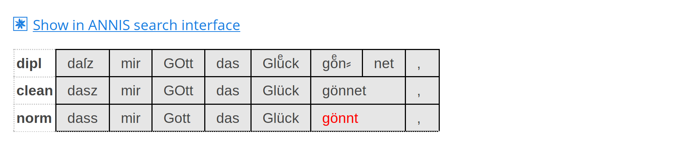
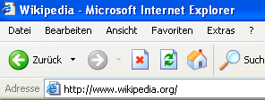
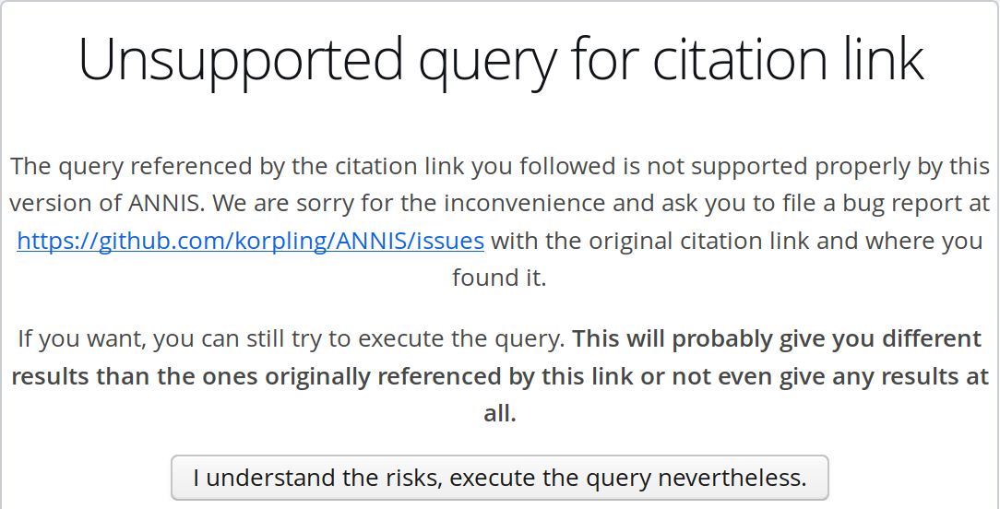
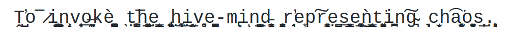

# Background

## The Hexatomic project

"A minimal infrastructure for the **sustainable** provision of extensible *multi-layer annotation software for linguistic corpora*"

- Funded under the call "Research Software Sustainability" issued by DFG under grant number GA 1288/11-1 
- Runs from October 2018 until September 2021.

. . .

- Thomas Krause: computer scientist who slipped into linguistics
- Stephan Druskat: English major who turned into software developer
- Both: Research Software Engineers

## ANNIS and its query language

A web browser-based search and visualization architecture for complex
multilayer *linguistic corpora* with diverse types of *annotation*.

::: {.center .col-container}

::: col
{width=100%}
:::

::: col

- Annotations are structured information added to text 
- Used by expert users (linguists) to find and analyze linguistic phenomena
- ANNIS allows finding annotations and *combinations* of annotations with its domain specific query language AQL
- Each query returns a set of results, which can be analysed further
- Part of a collection of tools for linguists: corpus-tools.org
:::


:::


## Semantic Versioning

- Popularized by semver.org [@Preston-Werner]
- Explicit statement about compatibility between versions of API
- *MAJOR*.*MINOR*.*PATCH*
  - Only bug fixes when *PATCH* changes, API does not change
  - Additions to API marked as increase of *MINOR*
  - Removal and non-backward compatible changes needs an increase in *MAJOR*

. . .


Some open questions:

- What is part of the API in a complex piece of software with multiple components? 
  - REST-API?
  - Query language?
  - Data exchange format?
  - User Interface?

. . . 

- **Do we want to backward-compatible forever? Is there a “1.0 release anxiety”?**


## Persistent Identifiers (PIDs)


[](https://doi.org/10.5281/zenodo.1161400)


- In general: resolving an identifier to a resource (digital or or not)
- **Should never change**: you can print it in a book!
- Several systems exist, like e.g. DOI, handle.net, ...

. . . 

Some open questions:

- If a digital resource moves, who updates the reference?
- Who provides and pays the infrastructure?


# Achieving backward compatibility in ANNIS 4.x

## What is the digital object defined by ANNIS citation links?

- ANNIS allows generating short links to query results and single matches, e.g.
[https://korpling.org/annis3/?id=813c3146-2d10-4d0c-8a1f-1b5efc3c051a](https://korpling.org/annis3/?id=813c3146-2d10-4d0c-8a1f-1b5efc3c051a)

- Glorified URL shortener: expands to a longer URL encoding the match and the actual query, e.g. https://korpling.org/annis3/#_q=bm9ybT0vZ8O2bm50Lw&_c=UklER0VTX[...]
-  Query is executed each time the link is opened, no result identifers are saved

## Backward compatibility

Problem:

- ANNIS 3: AQL queries are mapped to SQL queries and executed by PostgreSQL
- ANNIS 4: custom in-memory graph-based search engine written in Rust, which directly executes AQL [@Krause2019]

All old reference links should still work.

. . . 

Users literally printed these links in books.

. . .

Solution 1: keep the old software running forever (parallel to the new one)

. . . 

**Solution 2: Make sure that each query that has been referenced produces the same result in ANNIS 4 as in ANNIS 3 **

. . . 

- Execute each referenced query on both ANNIS 3 and 4
- Compare the results
- If successful: Migrate the links to the new ANNIS 4 installation


## Query language incompatibility is a feature

- New version will remove some query language functions and fix bugs in the query execution
- Backward compatibility means replicating these bugs

. . . 

:::  center

Remember me?



:::

- We need a quirks mode like e.g.
  - Internet Explorer
  - Rust Editions ([https://doc.rust-lang.org/book/appendix-05-editions.html](https://doc.rust-lang.org/book/appendix-05-editions.html))


# Problems when changing the implementation for a query language

## Formalized semantics of the data model and the query language

- In ideal world a query language is formally defined like e.g. Datalog
- All you need to restore a digital object would be the data and any implementation conforming to the specification

. . . 

::: {.center .large}

Real world: SQL

:::

. . . 


- SQL versions have been standardized (..., SQL-93, SQL:1999, SQL:2003, ...)
- Various implementations (MySQL, PostgreSQL, Oracle, DB2, SQLite, ...) with different support for the standard and vendor extensions
- Switching database implementations without abstraction layer like ORM not an easy task
- AQL has only two implementations, but first implementation heavily relied on semantics of SQL and its implementation PostgreSQL

## Not implemented functions of the query language

- A query language can accumulate a large number of features over time
  - AQL has a large number of binary operators that describe the relation between two nodes in the graph
- Not all of them are orthogonale to each other an can be replaced

. . .

- Move implementation of such features to a specific code path that separate the “real” query language from the ugly parts
- Check for actual used PIDs/reference links makes it transparent if a query language features has been used and needs emulation

. . . 

- If too hard to implement:

::: center

{height=200px}
  
:::

## Identifiers might change

- Each node in the graph has an URI and internal identfier
- Matches are lists of URIs and additional names for the label the match refers to
- A match is only the same, if all URIs are the same

. . .

People will use weird names

- Spaces, slashes, Umlauts, ...
- Double percent-escaped characters

. . . 

- Everything Unicode has to offer

::: center

{}

::: tiny
[https://github.com/minimaxir/big-list-of-naughty-strings](https://github.com/minimaxir/big-list-of-naughty-strings)
:::

:::

$\rightarrow$ Importing data with IDs and comparing them is hard 

## Regular Expressions

Regular expressions are an important part of AQL for matching node and edge labels

. . .

```sql
-- PostgreSQL
SELECT * FROM t WHERE a ~ 'val.*';
-- MySQL 
SELECT * FROM t WHERE a REGEXP 'val.*';
```
- Syntax varies from each implementation, even if „supporting POSIX“
- Regular expression engines often allow to search for non-regular expressions like backreferences and other extensions: some implementation trade features against speed (e.g RE2 from Google)
- “Power-Users“ will use all regular features available, even if never officially documented


## String ordering/collation

For query results, the order of the results is important, e.g. when refering to matches
$\rightarrow$ ANNIS 4 reference migration checks order of the matches as well


What is the result of the following SQL query?
```sql
SELECT '_' < '-';
```

. . .

- Depends on your localization! `LANG=C` != `LANG=en_US.UTF-8` != `LANG=de_DE.UTF-8`
- PostgreSQL allows to configure the collation for a column of a table explicitly
```sql
CREATE TABLE test1 (a text COLLATE "de_DE");
```

::: center
Anyone ever defined their tables this way *before* having collations issues?
:::

# Conclusion

## Conclusion

- ANNIS 4 is currently in public beta
- Users created 12.828 reference links so far on our public ANNIS 3 installation

. . .

::: center
All but 137 queries are known to give the same results in ANNIS 4
:::

. . . 


- Issues remaining
  - Regular Expressions
  - unsupported binary operators (might not fix)
  - actual bugs

. . .

- Having these reference links gives us a huge **real world test set**
- **Automatic migration** for persistent IDs
- **Transparency** for the **administrator** which queries he can migrate to a new instance
- **Transparency** for the **end-user** if a query is known not to work, no silent failure
- We will be able to **retire ANNIS 3** while keeping all these reference links valid

# Appendix

## References
