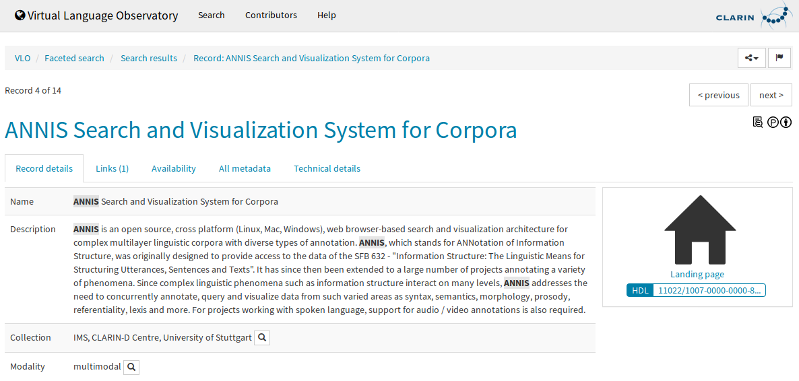
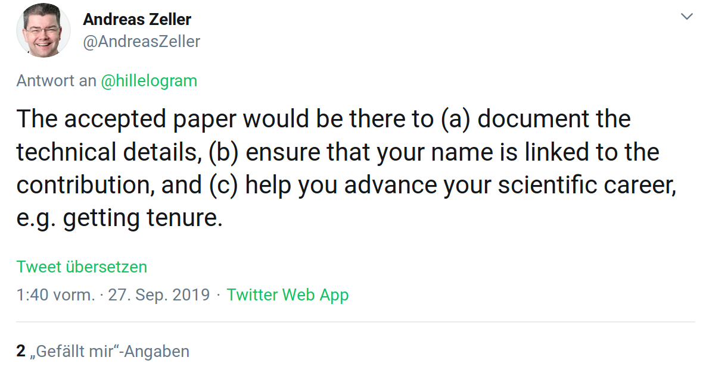

# Fachspezifika

## Linguistik - Formate

- **Papers, Monographien (inkl. z.B. Grammatiken & Wörterbücher), Konferenzbeiträge**

. . .

- Modelle [*d*]
- Datensätze (v.a. Korpora) aus analogen oder digitalen Quellen [*a/d*]
- Datenbanken (z.B. Treebanks, typologische Datenbanken) [*d*]
- Standards (z.B. Tagsets) [*a/d*]
- Software [*d*]
- technische Berichte (Annotationshandbücher, etc.) [*a/d*]
- Digitalisate (z.B. von Handschriften) [*d*]

allgemein nativ [*a*]nalog / nativ [*d*]igital

## Linguistik - Wahrnehmung und Nutzung digitaler Formate

- datengetriebene Teilbereiche (z.B. Korpuslinguistik, Computerlinguistik, Phonetik, moderne hist. Linguistik)
- Forschungsdaten sind zentral und werden auch so wahrgenommen
- Forschungssoftware ist zentral, wird aber nur teilweise so wahrgenommen (Computerlinguistik)

## Forschungssoftware - Qualitätssicherung

- analog zu Lebenswissenschaften
- softwaretechnische Qualitätssicherung: vs. Praxis (Fähigkeiten, Ressourcen, Anreize)
- wissenschaftliche Qualitätssicherung: nur über Metaformate (Papers)
- Validität sekundärer Qualitätssicherung?

## Forschungssoftware - Anerkennung und Gratifikation

::: {.center .large}
  
   
Nein

:::

. . . 

::: {.center}

(bzw. kaum, v.a. sekundär via Paper)

:::

## Forschungssoftware - infrastrukturelle Unterstützung - Infrastrukturen

### z.B. CLARIN (ERIC)

- webbasierte Analysewerkzeuge: Nutzung?
- Virtual Language Observatory (Suchmaschine)

. . .

**Distribution (Publikation)? Vernetzung? Auswertung?**

## VLO

::: {.center}

:::

## Forschungssoftware - infrastrukturelle Unterstützung - Infrastruktur

:::::::::::::: {.columns}
::: {.column width="75%"}

- Ausbildung?
- Karrierepfade?
- grundständige Finanzierung?
- softwarespezifische Infrastruktur (VCS, CI, etc.)?
- dedizierte Softwarerepositorien/-archive?
- (disziplinspezifische) Policies / Guidelines?
- zentrale Anlaufstellen?
- nicht-projektgebundene Softwaregruppen?

:::
::: {.column width="25%"}

- informell
- Nein
- kaum
- teilweise
- Nein/Zenodo
- Nein
- de-RSE
- kaum

:::

::::::::::::::

# Entwicklungs-, Steuerungs-, Reformbedarfe bzgl. Software-Publikationen

## State of the art

::: {.center}

:::

## "Will an accepted paper increase the odds that people will use it?"

::: {.center}

:::

## Publikationen

- "Document the details"
- "Link name to contribution"
- "Help advance careers"

## Was ist der Forschungsbeitrag?

- Paper?
- Service?
- Datenoutput?

. . .

- **Software!**
- "Document the details": Software ist "the details"
  - Code ist Dokumentation
  - (Softwaredokumentation ist Dokumentation)
- **Bedarf$_1$: Kulturwandel**

## Attribution

- "Link name to contribution"
- **Bedarf$_2$: Metadaten**
  - [Citation File Format (CFF)](https://citation-file-format.github.io) [@druskat_stephan_2018_1405679] - Autorenformat
  - [CodeMeta](https://codemeta.github.io) [@jonesCodeMetaExchangeSchema2017a] - Austauschformat
  - Steuerungsbedarf: Metadaten fordern
  - Entwicklungsbedarf: Metadaten in Publikationsplattformen integrieren

## Zitierung

- "Link name to contribution" + "Help advance careers"
- **Bedarf$_3$: Zitierpraxis**
  - neben allgemeinen - z.B. DFG Kodex 2019 [@deutscheforschungsgemeinschaftdfgLeitlinienZurSicherung2019] -
  spezifische Richtlinien und Policies für Herausgeber\*innen, Gutachter\*innen, Autor\*innen (derzeit entwickelt von [FORCE11 SCIWG](https://www.force11.org/group/software-citation-implementation-working-group) Guidance Task Force)
- Steuerungsbedarf: Evaluation inkl. Softwareveröffentlichungen
- Softwarezitierung hat zentrale Rolle für Reproduzierbarkeit
- Entwicklungsbedarf: Software muss eigene Referenzen zitieren (eigene Dissertation)

## Publikationsplattformen

:::::::::::::: {.columns}
::: {.column width="50%"}

- Journal of Open Source Software (JOSS) / Software Journals?
- Zenodo
  - DOI für Versionen
  - DOI für "Konzept"
  - Metadaten?
  - Peer Review?

:::
::: {.column width="50%"}

:::
::::::::::::::

## Publikationsplattformen

- **Bedarf$_4$: geeignete Publikationsplattformen, Auffindbarkeit**
- Entwicklungsbedarf: wiss. Softwarearchiv mit PID, Versionen + Konzepten, (Zitations-)Metadaten; (Bibliotheken? NFDI?)
- Entwicklungsbedarf: Peer Review für Forschungssoftware; neue Rolle für Software Journals ohne Fließtextveröffentlichungen? 

## Karrierepfade

- "Help advance careers" - **Bedarf$_5$: Karrierepfade**
- Research Software Engineers analog zu wiss. Stellenbeschreibungen
- Reformbedarf: Grundlagen der Softwareentwicklung in Curricula
- Reformbedarf: Karrierepfade entwickeln und implementieren
- Steuerungsbedarf: (grundständige) Finanzierung softwarerelevanter Stellen, z.B. Grundsicherung durch Institutionen + Finanzierung durch Drittmittel
- Steuerungsbedarf: Einrichtung institutioneller RSE-Gruppen nach britischem Vorbild (?)

## Danke!

::: {.center}

### Was sind Ihre Fragen?

stephan.druskat@dlr.de  
Twitter: [\@stdruskat](http://twitter.com/stdruskat)  
ORCiD [0000-0003-4925-7248](https://orcid.org/0000-0003-4925-7248)  
vorstand@de-rse.org  
Folien: [doi:10.6084/m9.figshare.9918653](https://doi.org/10.6084/m9.figshare.9918653)

:::

# Appendix

## Referenzen 